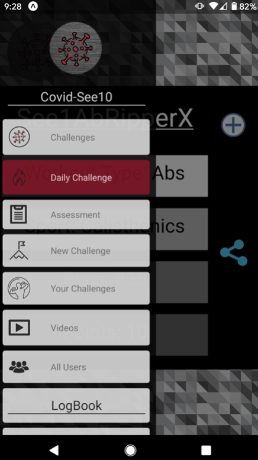
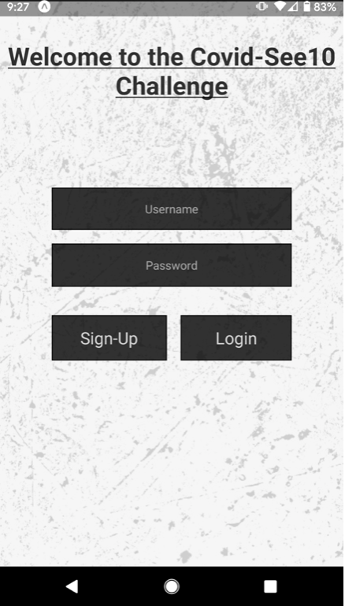
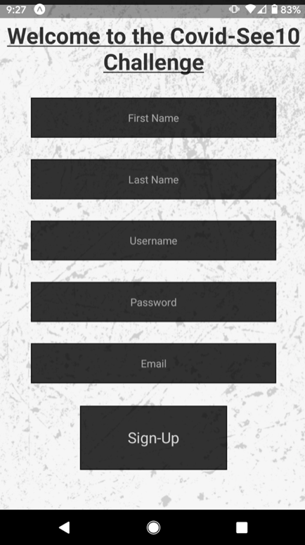
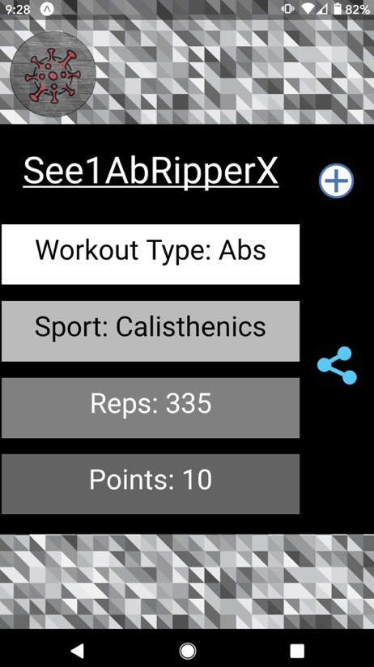
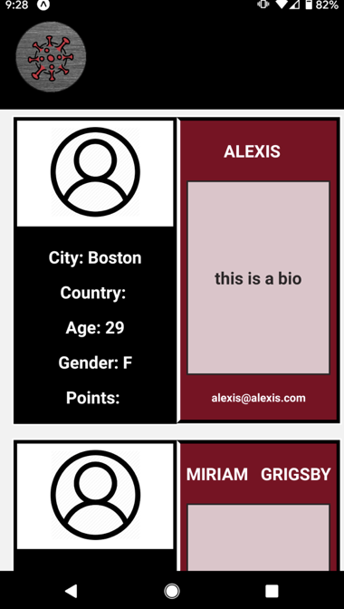
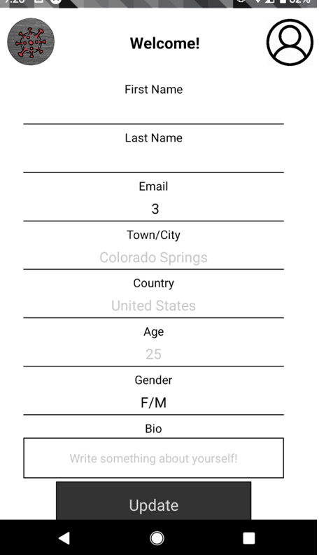

A React Native-Django Python Application written to bring the community together during the Covid-19 outbreak. The app serves as a fitness platform where they can be held accountable for their lockdown fitness goals. 

## Video Walk Through

* [Walk Through Video]()

## Motivation

During the Covid-19 lockdown of 2020 fitness challenges have begun to trend on social media sites, namely instagram. The challenges usually consist of a challenge like "See 10 Pull-Ups, Do 10 Pull-Ups", which encourages all the people who viewed that post to do the same work-out challenge. The trend is popular and people seem to actually be holding themselves accountable. Users can also tag their friends in the challenge to entice them to complete it. It has become so popular that it only made sense to abstract the challenges out into a platform centered around one goal: Challenging Yourself and Others to continue working out during the lockdown. Not everyone has an instagram or can see the trend so the application aims to bring the support and excitement of these challenges to the everyday user. 

## Getting Started

If you wish to fork/clone the repo, do so in conjunction with the backend found at [Back End Repo](https://github.com/alexiscait142/covid-hackathon). 

### Tech Stack

Python Backend

React Native Frontend 

### Installation

The app front is built with React Native which requires the following commands to run: 

    Download the Expo application for React Native development onto mobile device
    
    Npm install to download all npm packages 
    
    Scan QR code with phone's camera which will open app in Expo

    Run expo start
    
### React Native Dependencies/Node Packages

The app requires the following packages: 

    npm install @react-navigation/drawer
    
    npm install axios
    
    npm i react-native-elements
    
    npm i react-native-gesture-handler
    
    npm i react-native-webview
 
### Features

The main features of the app include: full authentication, viewing all challenges, adding/deleting all challenges to your list, a daily challenge, a travel menu to take you to different pages, a free online assessment, a form to create a new challenge for everyone to see, a place to view/delete/complete your challenge, a video tab to see all the videos everyone has uploaded, a tab to see all the users profiles, a logbook to view all your completed challenges, a scoreboard, an updatable profile page. 

### Operation Overview

From the landing page, the user can login or sign-up for the application. Once logged in, they can scroll through all the available challenges and join them. They can also view and join the daily challenge. The user can swipe right from the left side of their phone or click the button always located in the top left to toggle the navigation drawer. This menu allows the user to travel to any page in the app or logout. From here, the user can take an assessement, create a new challenge, view all their challenges, view every users videos, see all users profiles, and create or update their profile page. 

### Challenges

Here the users can see all the created challlenges. Each challenge has a name, a type, a sport, points, and reps. They can learn a little about what the challenge requires before joining in. 
 

### Daily Challenge

Similar to Challenges, the Daily Challenge gives the user the same workout info, but WATCH OUT, this challenge is worth more points. Join this challenge to increase your rating. 
 

### Assessment
    
For the less experienced user, take an online assessment through the application to determine your current health level and see tips on what kind of excerises to do to increase your fitness. Use this as a guide to decide which challenges to take on (Willingly for now!)

### New Challenge

Fill out the form to create a new challenge for all users. It doesn't auto add that to your list of running challenges, so be sure to grab it from the main challenge page. 

### Your Challenges

Scroll through a list of all your challenges. Think of this as your one-stop-shop for all things YOUR fitness related. You can press on a challenge to complete it (actual form for completion not-viable), or press and hold to permanently leave the challenge. Right now, your on an honor code to complete the challenges you're a part of everyday and within 24 hours. Soon, the app will boot you off the challenge if not completed in 24 hours. You will only gain points for completing a challenge. You'll be renewed to the challenge everyday until you choose to leave. 

### Videos

Currently unavailable, but a feature that will display all users uploaded videos/photos. You will scroll through them to be inspire to join a challenge, or to prove your friends actually completed them! (Friends/share feature to come!)

### All Users

This page displays all the user profiles. If they have an uploaded photo, it will display here with information about them. For now, reach out to their listed email, but look out for the future friend function to join them in the application.

### View

This page displays all of your completed challenges. That's why it's a logbook, to log what challenges you completed on what day. Once this page is up and running, you'll be able to view your photos and all information pertaining to any completed challenge. 

### Ranking

Want to know how you match up? View the ranked list of users and your placement here (future feature). 

### Profile

Fill out this form on sign-up to create a visible profile with a photo and more about you. This will become visible to everyone, so keep that in mind. You can go back and edit it at any time!

### Future Functions
    
Because the entire application was written in under 5 days, there are quite a few future functions to come, but the application was written as a submission for the Global Covid-19 Hackathon in an attempt to bring the community together!

### Acknowledgements

Alexis Chilinski for her work on the deployed backend found here [Back End Repo](https://covid-see10.herokuapp.com/) and for her inspiring me to join her on the hackathon. 

